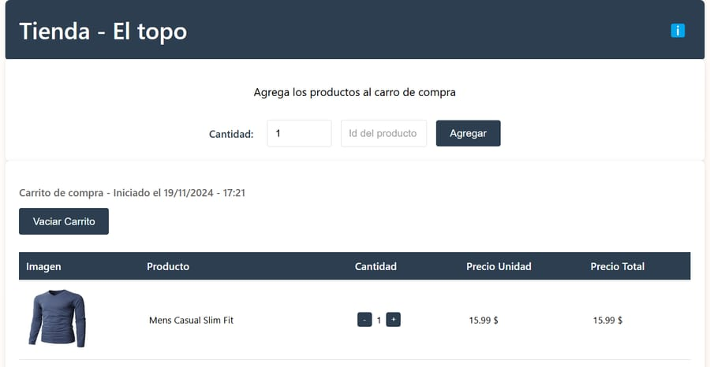

# Challenge de Wallbit. 🚀

**Solución al challenge de Wallbit para el stream Goncy 👏**

## Proyecto desarrollado con React+Vite. 💻

Todos los estilos están en CSS.

### Instalación local

- git clone https://github.com/efe13dev/wallbit-challenge.git
- cd wallbit-challenge
- pnpm install
- pnpm dev

## Links:

### [Repositorio](https://github.com/efe13dev/wallbit-challenge)

### [Deploy](https://wallbit-challenge-efe-13.vercel.app/)

